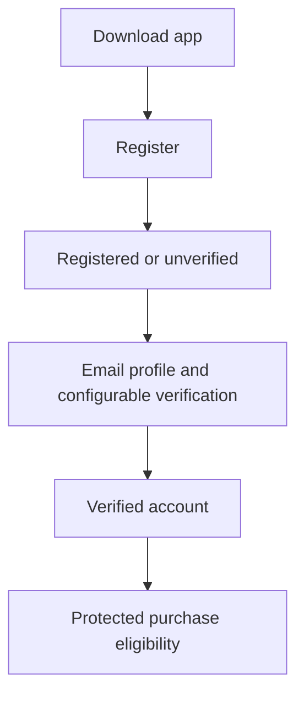
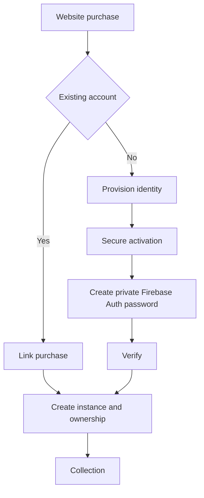
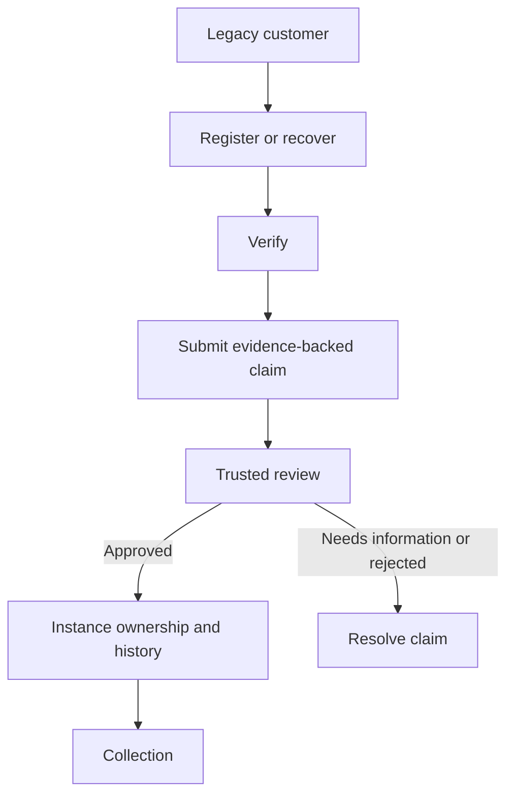
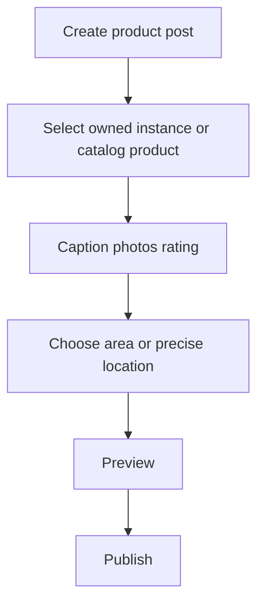
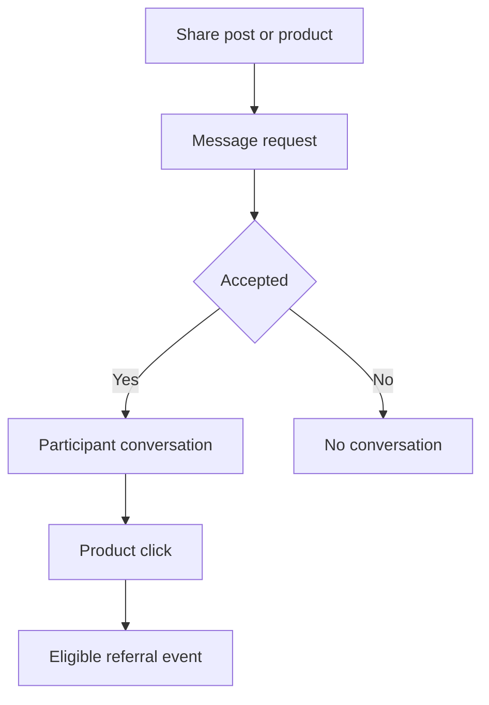
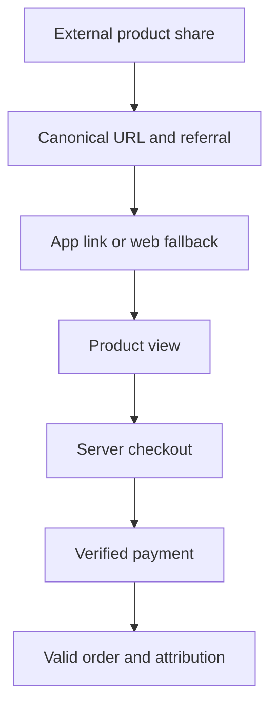
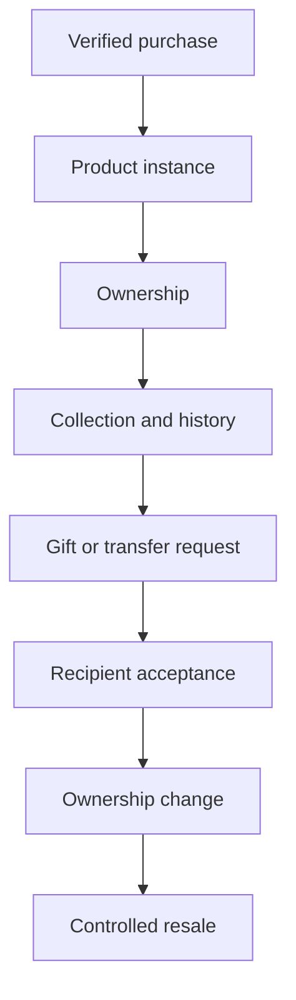
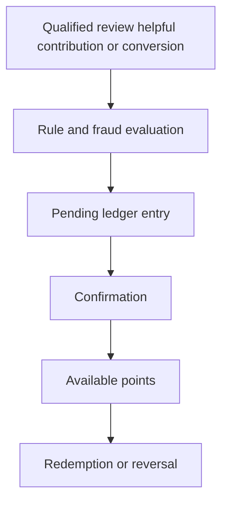
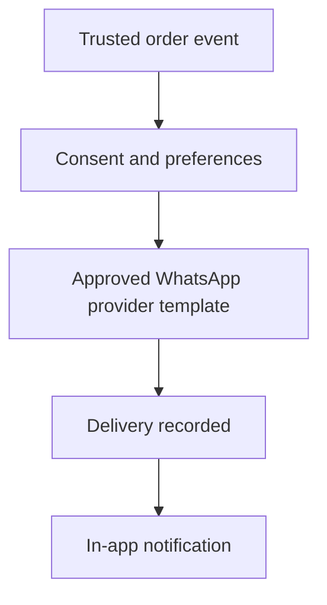

# SincerelySea Target User Flows

Target only; trusted actions are server-controlled.

```mermaid
flowchart TD
  A[Download app] --> B[Register] --> C[Registered or unverified] --> D[Email profile and configurable verification] --> E[Verified account] --> F[Protected purchase eligibility]
```

```mermaid
flowchart TD
  A[Website purchase] --> B{Existing account}
  B -->|Yes| C[Link purchase]
  B -->|No| D[Provision identity] --> E[Secure activation] --> F[Create private Firebase Auth password] --> G[Verify]
  C --> H[Create instance and ownership] --> I[Collection]
  G --> H
```

```mermaid
flowchart TD
  A[Legacy customer] --> B[Register or recover] --> C[Verify] --> D[Submit evidence-backed claim] --> E[Trusted review]
  E -->|Approved| F[Instance ownership and history] --> G[Collection]
  E -->|Needs information or rejected| H[Resolve claim]
```

```mermaid
flowchart TD
  A[Create product post] --> B[Select owned instance or catalog product] --> C[Caption photos rating] --> D[Choose area or precise location] --> E[Preview] --> F[Publish]
```

```mermaid
flowchart TD
  A[Share post or product] --> B[Message request] --> C{Accepted}
  C -->|Yes| D[Participant conversation] --> E[Product click] --> F[Eligible referral event]
  C -->|No| G[No conversation]
```

```mermaid
flowchart TD
  A[External product share] --> B[Canonical URL and referral] --> C[App link or web fallback] --> D[Product view] --> E[Server checkout] --> F[Verified payment] --> G[Valid order and attribution]
```

```mermaid
flowchart TD
  A[Verified purchase] --> B[Product instance] --> C[Ownership] --> D[Collection and history] --> E[Gift or transfer request] --> F[Recipient acceptance] --> G[Ownership change] --> H[Controlled resale]
```

```mermaid
flowchart TD
  A[Qualified review helpful contribution or conversion] --> B[Rule and fraud evaluation] --> C[Pending ledger entry] --> D[Confirmation] --> E[Available points] --> F[Redemption or reversal]
```

```mermaid
flowchart TD
  A[Trusted order event] --> B[Consent and preferences] --> C[Approved WhatsApp provider template] --> D[Delivery recorded] --> E[In-app notification]
```
